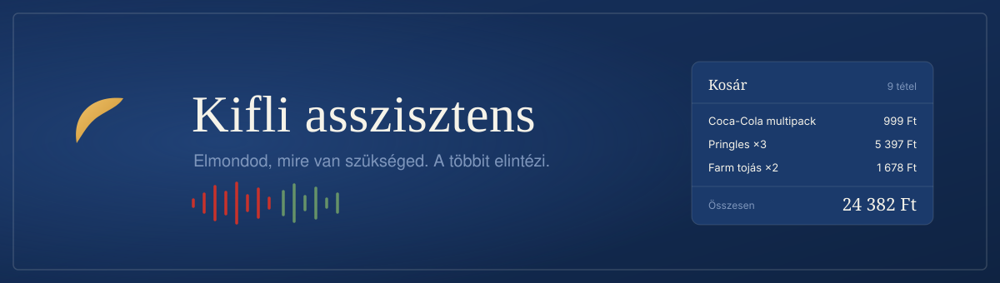
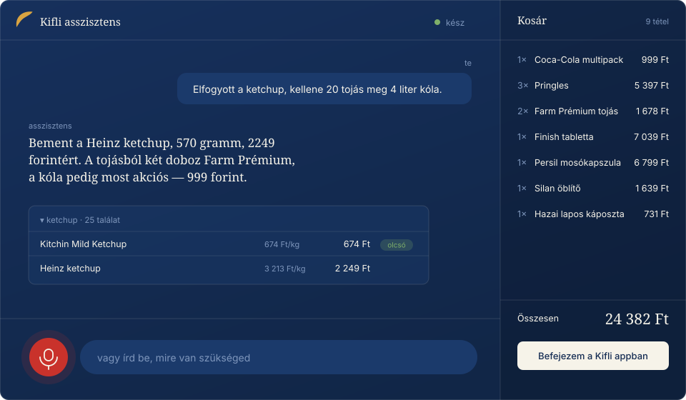

<div align="center">



<br>

**Beszélsz hozzá, és megtelik a kosarad.**
Magyarul, úgy ahogy tényleg beszélsz — „harminc deka trappistát”,
„inkább a Finish-t”, „mi a legolcsóbb márkás”.

<br>


</div>

<br>

> **Te:** Elfogyott itthon a ketchup, kellene 20 tojás meg 4 liter kóla.
> Mosogatógép tabletta is kell, márkás legyen.
>
> **AI:** Bement a Heinz ketchup, 570 gramm, 2249 forintért. A tojásból
> két doboz Farm Prémium, összesen 1678 forint. A kóla most akciós, a
> három és feles multipack 999 forint. A tablettából a Finish Power
> All in 1 nyolcvan darabos csomagja 7039 forint — mehet?

Nem kell gombot nyomni, és nem kell biztatni, hogy menjen tovább.
Elmondod, mire van szükséged, ő végigmegy rajta.

Vagy egyszerűen **lefotózod a cetlit**.

<br>

<div align="center">

</div>

<br>

---

## Mit tud

<table>
<tr>
<td width="50%" valign="top">

**Érti, ahogy beszélsz**

A „harminc deka trappistát” 300 gramm. A „kenyeret” kenyér. A tárgyeset,
a dekagramm és a tőhangváltás nem okoz gondot — a normalizáló 41 magyar
tesztmondatból 41-et old meg helyesen.

</td>
<td width="50%" valign="top">

**Lefotózod a cetlit**

Kézzel írt lista vagy képernyőkép. Amit nem tud biztosan elolvasni, azt
felolvassa és rákérdez — nem teszi be csendben. Telefonon a kamera, gépen
a fogd-és-vidd vagy a `Cmd+V`.

</td>
</tr>
<tr>
<td valign="top">

**Megtanulja a szokásaidat**

Ha egyszer megmondtad, hogy a „tejföl” nálad a Magyar Tejföl 20%,
onnantól kérdés nélkül azt teszi be. A rossz tanulás egy paranccsal
törölhető.

</td>
<td valign="top">

**Kiszámolja a mennyiséget**

20 tojás → 2 doboz, mert tízesével árulják. Egy 16 tekercses csomag
vécépapír → 1 csomag, nem 16. Ezt a program számolja, nem a nyelvi
modell — abban hibázna.

</td>
</tr>
<tr>
<td valign="top">

**Ár-érték arányt elemez**

Tudja, hogy a pomace olívaolaj olcsóbb, de nem ugyanaz, mint az extra
szűz. A hústartalom, a szabadtartás és a teljes kiőrlés mind számít
neki.

</td>
<td valign="top">

**Ismeri az akciós szekciókat**

A hét akciói, többet olcsóbban, termékcsomagok, és az Xtra
előfizetőknek szóló külön kedvezmények. Szól, ha a szokásos terméked
épp akciós.

</td>
</tr>
<tr>
<td valign="top">

**Tudja, mikor és hova szállítanak**

Felolvassa a legkorábbi szabad idősávot az árával, jelöli a prémium és
öko sávokat, és ismeri az előfizetésedet.

</td>
<td valign="top">

**Mindig visszamondja**

Minden betett tétel névvel, kiszereléssel és árral hangzik el. Képernyő
nélkül is ellenőrizhető.

</td>
</tr>
</table>

### Amit szándékosan nem tud

**Nem fizet és nem ad le rendelést.** A kosarat előkészíti, a fizetés és
az időpontválasztás a tiéd, a Kifli appban. Ez nem hiányzó funkció,
hanem tervezési döntés: automatizált pénzköltés nélkül is megvan a
haszon.

---

## Telepítés

Kell hozzá **Python 3.9+**, **Node.js** és egy **OpenAI API kulcs**.

```bash
git clone https://github.com/babszon/Kifli_Assistant.git
cd Kifli_Assistant

python3 -m venv .venv
source .venv/bin/activate          # Windows: .venv\Scripts\activate

pip install -r requirements.txt
python3 telepites.py
```

A telepítő végigvezet mindenen: ellenőrzi a rendszert, bekéri az OpenAI
kulcsot és a Kifli belépési adataidat, **teszteli a kapcsolatokat**, és
felajánlja, hogy betölti a korábbi rendeléseidből, mit szoktál venni.

Ha rossz jelszót adsz meg, ott és akkor derül ki, nem a harmadik
futásnál.

<details>
<summary><b>A terminálos változathoz kell még</b></summary>

<br>

```bash
# macOS
brew install portaudio

# Linux
sudo apt install portaudio19-dev ffmpeg
```

A grafikus felülethez ezekre nincs szükség — ott a böngésző kezeli a
mikrofont.

</details>

---

## Használat

```bash
source .venv/bin/activate
python3 kifli.py
```

Megnyílik a böngészőben. Kattints a **Mehet** gombra, engedélyezd a
mikrofont, és beszélj. Ha nincs mikrofon vagy nem engedélyezed, a
felület gépelve ugyanúgy működik.

| Parancs | Mit csinál |
|:--|:--|
| `python3 kifli.py` | grafikus felület a böngészőben |
| `python3 kifli.py --terminal` | hangvezérelt, terminálban |
| `python3 kifli.py --gepelt` | gépelt beszélgetés, terminálban |
| `python3 kifli.py --proba` | mindent megcsinál, de nem ír a kosárba |
| `python3 kifli.py --tanultak` | mit tanult meg eddig |
| `python3 kifli.py --felejts tej` | egy rossz tanulás törlése |
| `python3 kifli.py --telepites` | beállítások újra |

### A telefonon

Ugyanaz a beszélgetés, mint a gépen — a saját hangján, a saját
modelljével. A Siri nem érti meg, csak elindítja:

```
Te:      Hé Siri, Kifli
Te:      Elfogyott a mosópor
Kifli:   A Persil Color mosókapszula, 6799 forint. Betegyem?
Te:      Inkább olcsóbbat
Kifli:   A Tomi Power Caps, 5199 forint. Ez jó?
```

A felület telefonra alakul, kezdőképernyőre tehető, és ha az engedély
megvan, az ikonra koppintva **azonnal hallgat**. Művelet gombra is
köthető, akkor a Siri sem kell.

**[Lépésről lépésre: telefon beállítása →](docs/telefon.md)**

Aki inkább egyetlen gyors felvételt akar Siri-vel, beszélgetés nélkül,
annak ott a [kisebb API](docs/siri.md) (`api.py`).

### Szerveren, hogy mindig menjen

A gépednek nem kell ébren lennie. Synology NAS-on, VPS-en vagy bármilyen
x86 gépen egy paranccsal elindul:

```bash
docker compose up -d --build
```

A hangot továbbra is a böngésződ veszi — a szervernek nem kell
hangkártya. Csak a logika fut ott, mindig.

**[Lépésről lépésre: NAS beállítása →](docs/nas.md)**

### Három változat, egy kódbázis

|  | Grafikus | Terminálos | Telefonos API |
|:--|:--|:--|:--|
| Indítás | `kifli.py` | `kifli.py --terminal` | `api.py` |
| Beszélgetés | igen | igen | egy kör |
| Képfeltöltés | igen | nem | nem |
| Telefonról | igen, HTTPS-sel | nem | igen |
| Visszhangtörlés | **hardveres** | szoftveres | — |
| Függőség | `websockets` | + `sounddevice` | nincs |
| Mire jó | mindennapi használat | szerver, Home Assistant | eszembe jutott |

A böngésző ugyanazt a visszhangtörlést kapja az operációs rendszertől,
amit a Zoom és a Meet használ.

---

## Hogyan működik

```
  böngésző                 Python                  OpenAI
  ────────                 ──────                  ──────
  mikrofon  ──── hang ───►  híd  ──── hang ────►  realtime
  kamera    ──── kép ────►   │                        │
  (visszhang-                │      ◄── eszköz ───────┘
   törléssel)                ▼        hívások
  felület   ◄── esemény ── Kifli.hu · tanulás · egységár
```

Az asszisztens **tizennyolc eszközt** kap: keresés, kosárkezelés,
mennyiség-módosítás, feltöltött lista, akciók és akciós szekciók,
korábbi rendelések, étkezés-javaslatok, szállítási idősávok, előfizetés
és cím.

De a **mennyiségszámítás, az egységár és a visszaigazoló mondatok a
programban készülnek**, nem a modellben. Ez a projekt legfontosabb
tervezési elve: ahol a modell csendben hibázna, ott kód dolgozik.

Az API kulcs a Python oldalon marad, nem kerül ki a böngészőbe.

<details>
<summary><b>Fájlok</b></summary>

<br>

| Fájl | Mire való |
|:--|:--|
| `kifli.py` | indító |
| `telepites.py` | telepítő varázsló |
| `gui.py` | a grafikus felület szervere |
| `webui/index.html` | az asztali felület |
| `webui/mobil.html` | a telefonos felület |
| `asszisztens.py` | az eszközök és a rendszerprompt |
| `kep.py` | bevásárlólista kiolvasása fotóról |
| `realtime.py` | hangvezérelt beszélgetés terminálban |
| `hang.py` | mikrofon, felismerés, felolvasás |
| `motor.py` | OpenAI / Gemini szöveges tool calling |
| `mcp_kliens.py` | kapcsolat a Kifli szerverhez, rátakorláttal |
| `parser.py` | a Kifli válaszainak feldolgozása |
| `arak.py` | egységár-számítás |
| `adat.py` | tanulás (SQLite) és Home Assistant |
| `llm.py` | a magyar szöveg normalizálása |
| `szinkron.py` | listából kosár, beszélgetés nélkül |
| `api.py` | telefonos gyorsfelvétel (Siri) |
| `tesztek.py` | 64 funkcionális teszt, hálózat nélkül |
| `ellenorzes.py` | statikus ellenőrzés |
| `Dockerfile` | szerveres futtatás (NAS, VPS) |

</details>

<details>
<summary><b>Home Assistant integráció</b></summary>

<br>

Ha van Home Assistanted, a bevásárlólistát onnan is olvashatja. Tedd a
`.env`-be:

```
HA_URL=http://192.168.1.10
HA_TOKEN=<hosszú élettartamú token>
HA_TODO=todo.bevasarlolista
```

Utána:

```bash
python3 szinkron.py
```

A listát magyarul diktálhatod a Home Assistantbe egy custom sentences
fájllal. A lista nyersen tárolja, amit mondasz — az értelmezés a
szinkronizálásnál történik, egyszer.

</details>

---

## Biztonság

- A **Kifli jelszavad** a `.env` fájlban van, a gépeden, `600`
  jogosultsággal. Nem megy sehova rajtad és a Kiflin kívül.
- A `.env` és az adatbázis a `.gitignore`-ban van. A CI minden
  pusholásnál ellenőrzi, hogy nem szivárgott-e ki titok.
- A **beszéd** és a **feltöltött képek** az OpenAI-hoz mennek fel
  feldolgozásra.

> [!WARNING]
> A projekt a [`rohlik-mcp`](https://github.com/tomaspavlin/rohlik-mcp)
> szervert használja, ami a Kifli **nem hivatalos** API-ját szólítja
> meg. Ez az ÁSZF-be ütközhet, és egy alkalmazásfrissítés bármikor
> elronthatja. **Ne használd ugyanazt a jelszót máshol.**

---

## Ismert korlátok

- A rendelés leadása mindig kézi.
- **Nem tud idősávot foglalni és címet váltani.** Ezeket a Kifli API-ja
  nem adja ki olvasáson túl. Az idősávokat felolvassa árral együtt, a
  választás a Kifli appban történik — ahol úgyis fizetsz.
- **Nem lát termékleírást** — a Kifli keresője nem adja vissza, így a
  minőségi különbségeket a termék nevéből olvassa ki.
- A Kifli időnként más árat számol, mint ami a keresőben látszik
  (akciók, kimért áruk). Ilyenkor a kosár ára az igaz, és az asszisztens
  azt mondja.
- **A Kifli rátakorlátot szab.** Sok termék egyszerre, vagy sűrű
  használat után lassít. A program magától vár és újrapróbál, de ha
  tartósan blokkol, pár percet kell várni.
- **A kézírás felismerése nem tökéletes.** Ezért minden bizonytalan
  tételre rákérdez, ahelyett hogy találgatna.
- A hangfelismerés ritka márkaneveket félrehallhat. A gyakoriakat
  (Old Spice, Hellmann's, Heinz, Finish) megtanítottuk neki.
- **Autóban visszhangozhat** — ott erős a hangszóró és a mikrofon közti
  csatolás. Fejhallgató vagy telefonos használat a járható út.

---

## Fejlesztés

```bash
python3 tesztek.py       # 64 funkcionális teszt, hálózat nélkül
python3 ellenorzes.py    # statikus ellenőrzés
```

A tesztek a Kifli valódi válaszformátumaival dolgoznak, hamis MCP
szerverrel — nem kell hozzá fiók és internet. Minden pusholásnál a CI is
lefuttatja őket, Python 3.9-en és 3.12-n.

Amit külön ellenőriznek, mert ezekben **csendben lehet hibázni**:

- a „30 tojás" 3 dobozt jelent, nem 30-at
- a „16 tekercses csomag" 1 csomag, nem 16 — a kiszerelés nem darabszám
- a kosár törléséhez a **Cart ID** kell, nem a termék ID-ja
- egy eszközhívás soha nem dobhat kivételt — a modell örökre várna
- a próba mód nem ír a valódi kosárba
- a kilogramm és a liter nem keveredik az egységár-összehasonlításban
- nem állítja, hogy lefoglalt egy idősávot, amit nem tud lefoglalni
- üres találatnál nem talál ki terméket
- egy várakozó hívás nem blokkolja a beszélgetést

## Közreműködés

Hibajelentést és javaslatot szívesen fogadok. Ha új funkciót írnál,
érdemes előbb egy issue-ban megbeszélni.

<div align="center">
<br>

MIT licenc · Független hobbiprojekt, semmilyen kapcsolatban nem áll a
Kifli.hu-val vagy a Rohlik Grouppal.

</div>
